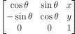
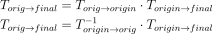
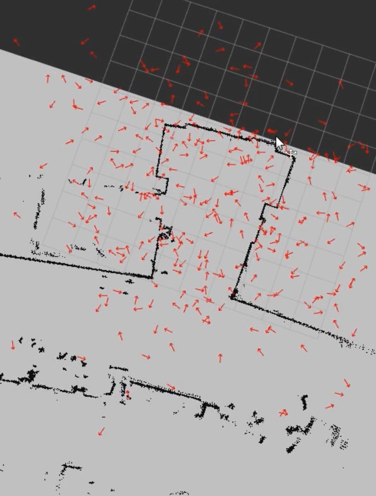

# Robot Localization

## Introduction
Localization is one of the core challenges to robotics. While many solutions
rely on external sensors, such as GPS, these tend to be expensive and require
manual setup in the environment the robot operates in. The localization
algorithm we will be exploring in this project is a particle filter, a
completely self-contained system using only a lidar sensor.

## Purpose
The goal of our project was the explore robot localization by implementing the particle filter algorithm. This work helped us build more fluency with ROS and robotics debugging.

## Implementation
The main steps of our algorithm were:
- Initialize a particle cloud
- Update the position of the particles based on the odometry data
- Update the weight of the particles based on the robot's laser scan
- Resample the particles

### Initialize the particle cloud
To intialize the particles, we drew points from a uniform gaussian distribution centered around the intial pose. With this method, we can adjust the standard deviation of the distribution in order to control the spread of the particles when initialized.

### Update particle position based on odometry
Every time we got an odometry update, each particle's pose was updated to follow
the same transformation the robot did. To do so, we started by representing each
particle pose as a transformation of a unit vector at the origin of the world
frame. Then, we computed the transformation matrix between the two robot poses
in the odometry frames. This transformation matrix was then applied to the
particle pose, effectively moving the particle pose by the same amount the robot
moved.

The transformation matrix for a general pose is:

This transforms a unit vector along the x axis to the specified pose. This is
especially useful because the same form can then represent a pose and also be
used to represent the transformation between poses.

To compute the transformation to apply, we start by representing the two robot
poses (original and updated) in the transformation matrix format. We can then
use the dot product of these two products to compute the transformation. We
use the inverse of the original robot position because this effectively
transforms a pose from the original robot position to the odometry origin, then
from the odometry origin to the final robot position.

The transformation matrices from the origin to the robot pose can be computed by
using the robot pose in the odometry frame. Because we are transforming to the
origin and then from the origin, the coordinate system origin we use does not
matter, and the odometry frame is the most convienent here.

### Update the weight of the particles based on laser scan
To weight the particles, we went through each particle in the cloud and performed the following steps:
- Go through each laser scan point from the robot and for each scan point:
- Calculate the laser scan point location as if the robot had taken it from the particle's position
- Find the distance to the closest obstacle to that laser scan point
- Pass that distance through a gaussian function, and add it to the weight of the particle
With this setup, particles that have laser scans with very small closest obstacles will be weighted highly, wheras particles with laser scans that are far off from the map will have lower weights. We can adjust the standard deviation of our gaussian function in order to either increase or decrease the distance between lower and highly weighted particles

## Resample the particles
To resample the particles, we simply draw a random sample from all the particles using the particle's weight as a bias. This makes the algorithm choose the heavily weighted (ie more likely) particles more often, which causes the particles to converge. However, because the highly weighted particles can (and probably will) be sampled multiple times, we also add in noise, which is sampled from a normal distribution. This noise ensures that the new particles have a bit of diversity, which keeps the particle filter from converging in the wrong spot too quickly.

How did you solve the problem? (Note: this doesn’t have to be super-detailed, you should try to explain what you did at a high-level so that others in the class could reasonably understand what you did).

## Demo
Below you can see our our particle algorithm localize the position of a neato robot in a small map. The particles are represented by small red arrows, the robot is represented by a large red arrow, and the laser scan is represented by red dots. We can see that as the robot drives around, particles begin to form a cohesive group, and the laser scan begins to align with map.  

We used the same visualization approach to localize the robot in a larger map. However, for this map we increased our intial particle spread. This spread is shown in the image below.  

Below we can see our algorithm localizing the robot in a larger map.  

## Design Decision
Describe a design decision you had to make when working on your project and what you ultimately did (and why)? These design decisions could be particular choices for how you implemented some part of an algorithm or perhaps a decision regarding which of two external packages to use in your project.

## Challenges
What if any challenges did you face along the way?

## Future Improvements
What would you do to improve your project if you had more time?

## Reflection
Did you learn any interesting lessons for future robotic programming projects? These could relate to working on robotics projects in teams, working on more open-ended (and longer term) problems, or any other relevant topic.

